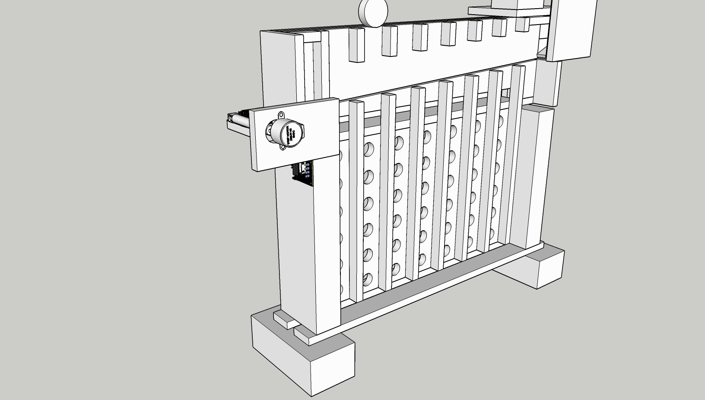
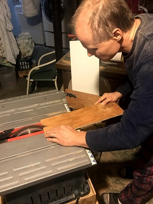
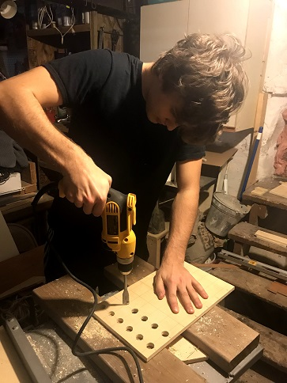
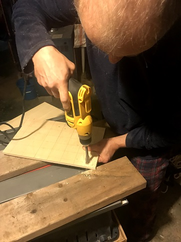
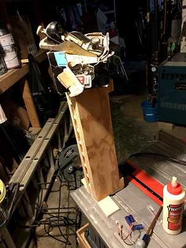
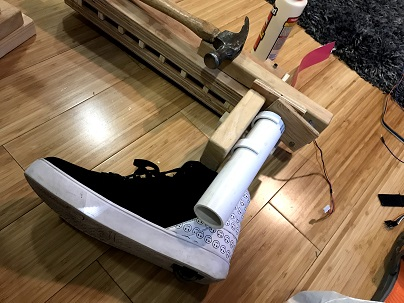
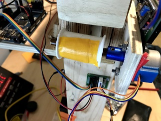
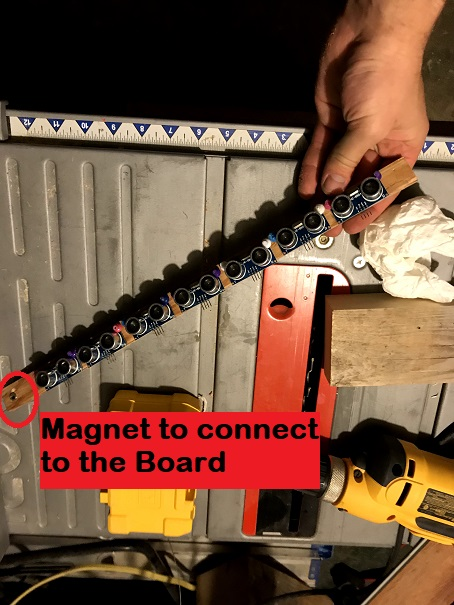
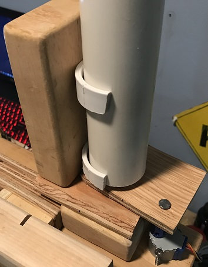
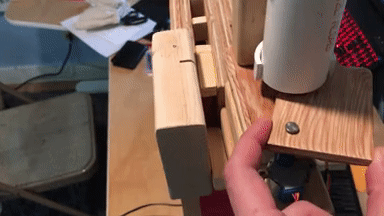

# The ConnectoBot

This robot is made structurally out of wood and programmed with an Arduino board. It communicates with a python program on the computer so that you can play connect 4 against it.

## Table of Contents
- [Introduction](#introduction)
- [The Python Code](#the-python-code)
  - [Board](#board)
  - [Arduino](#arduino)
  - [Player](#player)
  - [AIPlayer](#aiplayer)
  - [Main](#main)
  - [LCD Phrase Checker](#lcd-phrase-checker)
- [Designing a Model](#designing-a-model)
  - [General Ideas](#general-ideas)
    - [Choosing the Correct Column on a Move](#choosing-the-correct-column-on-a-move)
    - [Dispenser System](#dispenser-system)
    - [Detecting the User's Move](#detecting-the-users-move)
    - [User Accessibility](#user-accessibility)
  - [General Designing Challenges](#general-designing-challenges)
- [Building the Model](#building-the-model)
  - [Cutting the Wood](#cutting-the-wood)
  - [Creating the Holes for the Board](#creating-the-holes-for-the-board)
  - [Gluing and Sanding](#gluing-and-sanding)
  - [Belt and Spool](#belt-and-spool)
  - [Motor Power Supply](#motor-power-supply)
  - [Sensor Mount](#sensor-mount)
  - [Dispenser](#dispenser)
  - [The Rest of the Components](#the-rest-of-the-components)
- [The Arduino Code](#the-arduino-code)
  - [Checking the Columns for a User Move](#checking-the-columns-for-a-user-move)
  - [Moving the Belt Over the Correct Column](#moving-the-belt-over-the-correct-column)
  - [Printing on the 16x2 LCD](#printing-on-the-16x2-lcd)
  - [Navigating the Serial](#navigating-the-serial)
  - [The Remaining Code](#the-remaining-code)
- [Next Steps](#next-steps)
- [Materials and Parts Used](#materials-and-parts-used)

## Introduction

I wanted a project to work on during my winter break from college, so I decided to make a robot that uses some recursive AI connect 4 code that I wrote in python for an intro to CS class during my first semester. The code was originally intended to be played by using a python console, but I thought it would be cool to make a connect 4 board that could play its moves in real life, and any user could play against the board by just placing checkers normally. I decided that the best way to do this would be to build a board that could roll out its own checkers while communicating with my python program on the computer to send over the user's moves and to receive the computer's moves. Everything below outlines some of the steps and overall journey of completing this project, as well as a rough guide if anyone wants to try something similar.

## The Python Code

I included the python code for the game in this repository. There is a Board class, Arduino class, Player class, AIPlayer class, and a main file. I also used the pyserial library for easy communication between the arduino and the computer. Other than the python code that runs the game, I made a simple program to check lists of phrases to see if they will fit on my 16x2 LCD, and it puts the valid phrases in the format of a c++ array so I can easily copy and paste them into my arduino code. Since most of this project concerns the modeling and arduino code, I'm just going to give a quick rundown of how the python code works. More information on the code can be found in the files themselves along with the comments.

### Board

The connect 4 board is emulated in the Board class with a 2d array. The board has a flexible size, but in my case I built the standard 6 rows x 7 columns board. Empty slots are represented by the string ' ', and if a checker is dropped in a slot it is given a value of either 'X' or 'O', depending on which player the checker belongs to. The board class also checks if either player has won by looking for horizontal wins, vertical wins, down diagonal wins, and up diagonal wins. Each of these checks uses simple nested for loops and indexing. 

### Arduino

The Arduino class uses the pyserial library, and allows easy and organizable access for the game classes to communicate with the arduino. An Arduino object is initialized with a port, which can change depending on the computer that the arduino is connected to. I set the serial to be read at 9600 baud and gave it a standard timeout of 1 second. The class has simple read, write, open port, and close port methods. Again, this class was created so that the code could be cleaner in the other classes.

### Player

Two players are needed for a connect 4 game, and with my connect 4 board one of them will always be a human player. A checker (either 'X' or 'O') is initialized with a player object. The most crucial method in this class is the next_move method, which waits for the arduino to send over a column number which represents where the player placed their checker.

### AIPlayer

The AIPlayer class is a subclass of the player class. unlike the player class, its next_move method looks for the best next move by recursively creating more AIPlayers for each possible move. The amount of moves looked ahead is determined by a lookahead variable initialized in the class constructor. After playing other AIPlayers with the determined lookahead, scores are assigned to each column. If a column is full, it receives a score of -1. If a column will result in a loss, it receives a score of 0. If it will result in a win, it receives a 100, and if a win or loss is not discernable and the lookahead is exhausted, then it receives a score of 50. After these scores are found, the AIPlayer chooses the max scored column, or a random column from several columns that have the same max score. I've found that a lookahead of 5 finds a move in a reasonable amount of time and is still hard to beat. I plan to improve the AIPlayer class in the future to be faster and smarter.

### Main

The main file contains a communicate function that allows the program to start listening to the arduino, as well as a function that starts up a game between 2 players, which in this case will always be a Player and AIPlayer. There is also a process_move function which is executed every turn and receives a move from each player. After receiving a move, this function checks if either player won or if the board is full, which would result in a tie.

### LCD Phrase Checker

The LCD phrase checker figures out if a list of phrases given in a text file will fit on a 16x2 LCD. For all the valid phrases, they are outputted to a text file in the form of a c++ array. Any invalid phrases are also written to the text file a few lines below the array, along with the chars that would be cut off. I made a function checkPhrases that checks each phrase from a list by asserting that it is either less than or equal to 16 characters long, or that it can be split into 2 halves that are each less than or equal to 16 characters long. I could've checked over phrases manually, but this easy to write program has definitely saved a lot of time in the long run since I plan to add more phrases to the board once I finish cleaning up all of the essential aspects.

## Designing a Model

Designing a model was definitely one of the greater learning curves of this project. I decided to use SketchUp as a 3d modeling software to plan everything out, which made the cutting and building much easier later on. I started off by creating a rough model around the end of December, and this continued to change and develop until I finished my final model near the start of January, which can be found [here, uploaded to SketchUp's 3D Warehouse.](https://3dwarehouse.sketchup.com/model/7e1a40ce-af88-498d-99ae-3c84cc27af6c/Connect-4-Robot-Final-Model) I've included a couple 2D render images that show the board from the front with and without the face.

### General Ideas

#### Choosing the Correct Column on a Move

I decided that the way I wanted the board to roll out a checker would be to pull a flexible flat surface that looks like a belt (I used two pieces of duct tape stuck together) enter from the side and lie on a ramp that would run above the columns. This way, if I wanted a checker to go into a certain column, I could just have a motor pull the belt over the columns before the desired one, and the checker could roll on the belt and drop into the correct column when it runs out of belt to roll on. I decided that the best way for the belt to reset after a move would be to unwind the motor and have a weight on the end of the belt so that it would naturally drape back down.

#### Dispenser System

One of the more difficult parts of the model was figuring out the best way to dispense a checker one at a time without taking up too much space or having any checkers get stuck due to friction. I started off by modeling a separate dispenser system that could be placed next to the board structure, which would stack the checkers in a PVC tube, and "slice" the bottom checker out with a piece of wood pivoted by a motor. I kept this concept throughout the project, but eventually modeled the dispenser system directly onto the board, which decreased the total size of the project and made a cleaner look overall.

#### Detecting the User's Move

I needed a consistent way to detect if the user placed a checker in one of the columns, and at the time of starting my design I still didn't know what I was going to use for this. I finally decided to use infrared sensors, and line them up on a piece of plywood sticking out of the back of the board facing each column. After completing the build I started placing the cheap sensors that I bought, and I soon realized that the infrared rays were interfering with each other and that the calibration, which was not consistent, had to be done physically by adjusting the potentiometer with a screwdriver. I decided that I needed a better device for checker detection that could be calibrated through the arduino communication, and after I chose ultrasonic sensors I had to slightly adjust my already built model to accommodate the new sensors. 

#### User Accessibility

I didn't want the dispenser system or the belt/ramp feature of the board to get in the way of the user's normal gameplay, so I kept the openings of the columns to where the player puts their checkers above all of the other mechanisms. 

### General Designing Challenges

One of the greatest challenges in creating the model was availability of materials and keeping everything true to dimensions. I was using 1/2 inch plywood for most of the build, which I measured to be close to 11mm. My first few models were not true to this size, so I had to remodel everything based on what I had built before. Also, some of the components that I ordered online, such as the wooden checkers that I was using, had their dimensions reported wrongly by a few millimeters,. This resulted in more remodeling to keep some parts of the model from having too tight of a space or too much extra space. I started off by only allowing an extra 1mm of clearance for both the length and width of the checkers, but I soon realized that while cutting wood and gluing things together I would need more extra space than that, so I changed the clearance to 5mm for both the length and width of the checkers in the final model. 

I also had to figure out a good way to keep the dispenser system from getting clogged up. The biggest problem I had with this was that I wanted to use thicker wooden checkers, and the ones I chose had the "king/queen" feature that checkers are built with, which allows a player to stack two checkers more easily by having each checker be equipped with a hollowed out bottom and a raised top. Since I was using a pusher to slice a checker from the PVC tube one at a time, this feature would jam my machine. I decided to still keep my initial design, and I later added an extra build to the checkers which prevented them from stacking and becoming stuck to each other.  

The modeling part of this project may have not initially produced many physical results, but it definitely helped to conceptualize my ideas and I'm certain that the board wouldn't have been able to be built as smoothly as it was if I didn't create a good model.

## Building the Model

Most of the model was built by using plywood and wooden blocks, and I didn't know too much about woodworking, so luckily I had my dad to help me cut, glue, and teach me some things about different woodworking strategies. I decided to build the board part first, and then figure out the dispenser system after I got the board to work well.

### Cutting the Wood

We started off the build by cutting all of the wood to the dimensions that I had in the model of the board. Big thanks again to my dad, who did most of the cutting, especially since we didn't have all of the right tools. Although woodworking is fun, I've learned how hard it is to accurately cut out pieces of wood when everything is down to the millimeter. One of the hard cuts in particular was creating a channel for the tape belt to run through. We needed to do a slanted cut on 3 of the boards, which had to be done by hand on the table saw without a guider since we didn't have a working protractor guider.

The only other cutting that was involved in this project was cutting out the dispenser parts, which I did after I finished assembling the board and getting it to work.

### Creating the Holes for the Board

To make the holes for the board we used a 3/4 inch drill bit, which worked nicely to make the checkers visible but not take out too much wood from the board. After the project was finished, the checkers weren't perfectly visible, so if I did this part over again I would use a slightly larger drill bit.

	

### Gluing and Sanding

Most of the parts of the board needed a good sanding, and it really improved how everything looked in the final outcome. I took a picture of the face board when it was sanded compared to the back face to show the sharp contrast

After sanding the parts down I needed to do a series of glues to keep all the parts together. For some of the glues I was able to keep the wood connected with pressure by using small nails, but other times you really just have to use whatever is available since there were no wood clamps available, whether it be a box of nails, or a hammer on top of the wood being balanced by a spare Heely. Again, big thanks to my dad for teaching and helping me with some of the more conventional gluing methods.

	

Although there were a few hard to glue pieces, everything went pretty smoothly with this step in the project.

### Belt and Spool

To create the belt that runs along the ramp, I stuck two pieces of my trusty pink duct tape together and ran some fishing line through the middle of it so that I could pull it easily with a motor. I decided to connect the fishing line to a thread spool superglued to a a colored pencil, which I fastened to my motor with a shaft coupler. Pictures of the belt and spool/pencil mount are below.

	 

### Motor Power Supply

I started off by soldering some 9v battery cases for my 2 motors' power supplies, but after testing the board out I quickly realized that the motors used too much power to draw their energy from batteries. I moved on to soldering pin cables onto a 12v/2A power adaptor so that I would never have to worry about running out of power.

### Sensor Mount

The sensor mount I built is a thin strip of plywood that connects magnetically to the board. I didn't want to glue or permanently connect the sensor mount to the board, since I figured that I would need to disconnect some sensors or do maintenance over time. 

While I was trying to mount the ultrasonic sensors, I realized that I had no screws which could fit in the holes on the sensor boards. To fix this, I used some standard thumbtacks to hold them in. Unfortunately, the tops of the thumbtacks got in the way of the mount and I didn't have flatter thumbtacks at the time, so I needed to individually clip each of the thumbtacks' heads off with plyers to create a snug fit.

### Dispenser

One of the main challenges with the dispenser was figuring out the best way to connect the PVC pipe that holds the checkers and making a consistent pusher to slice a checker from the bottom of the pipe. I connected the PVC to the wood by using larger PVC pieces as clips and then screwing them into the wood block I wanted the PVC to attach to.

I also made a quick gif image to showcase the dispenser up close in action. I controlled the pusher with my hand in this example, but during a game the motor underneath the pusher moves it, which is connected with a coupler and a nail.

I also had a problem with the checkers getting stuck together since they are made to stack, but I fixed this by inserting three flat thumbtacks into each hollowed out face, which kept them from stacking.

### The Rest of the Components

Everything else is fairly straightforward and is built true to the model. As I mentioned before, the main structure used was 1/2 inch (~11mm) plywood, but for thicker pieces of wood I used any blocks or scrap planks that I could get my hands on. The final model, before any extra design, is below (pictures from the front and back respectively.

	

## The Arduino Code

Although the game is simulated on the computer, the arduino plays an important part in the project. It detects user moves, controls the belt/dispenser system, and displays messages for the user on an LCD. I'm going to go through some of the main sections of the code, giving a quick rundown of how they work and any particular development strategies and challenges that took place.

### Checking the Columns for a User Move

Writing a reliable function to check the columns of the board if a checker dropped into one of them was definitely one of the more difficult parts of the arduino code. After playing around with the sensors that I bought, I quickly realized that even if 2 sensors are the same distance apart, the hardware in them was not very consistent, so I would need to find a way to individually calibrate each sensor according to their reading. The sensors were accurate enough for larger changes in distance over more time, but to catch the change that a 10-11mm thick checker causes over the small window of time that it falls down the column needed more fine tuning. I also found that sometimes the sensors would misfire and cause an outlier value to be returned, so I needed a way to ensure that any detection was actually the result of a checker, and not one of these outlier values.

The first thing I did after testing each sensor individually was try to write a method that sets their trig pins on high all at once and then receives their pulses from the echo pins at the same time. I quickly realized that this did not work, and I would have to fire each sensor off individually in quick succession. After writing some code that would loop through each sensor in the least amount of time before any strange values occurred (which in my case was around 700 microseconds between each sensor reading), I decided to tackle the calibration problem. I created a calibrate function that would fire each sensor off a reasonable amount of times, and then take the average of each of these readings to use each sensor's average as a baseline of what they should be reading. Then, in order to detect a checker, I set a lower cutoff for each sensor, subtracting 20 microseconds from each baseline average. A couple of the sensors are more or less sensitive, so I adjusted this cutoff individually as necessary. 

After setting the cutoffs, a checkColumns function fires each sensor off and checks if there are any values returned below the lower cutoff. If there are any of these extreme values, then the sensor's respective column value is returned. At this point the code was working, but not consistently. Some sensors were occasionally returning values that were less than the cutoff even if a checker was not in front of them. To fix this, I modified the checkColumns function to focus in on one sensor if it returns an extreme value. The function then requests 3 more values in quick succession and takes the average of the extreme value and these 3 values. If this average is below the cutoff, then the column is returned. So far, I have not had any issues with this approach, and the sensors are able to handle the speed at which the checker falls.

### Moving the Belt Over the Correct Column

After setting up the belt and motor, I needed to figure out how many steps were required to move over the correct column and the speed at which to move. Since I have a power supply connected to the motors, I was able to move at a high speed, but I did notice that on battery power the motors had to be turned down to move much slower. Once everything was connected, I simply tested different amounts of steps until I found the sweet spot, which ended up being 303 steps per column. The belt would move over the correct column using this step count, push out a check and wait 3 seconds for it to role down, then reset and confirm that it is the user's turn once the motor is done moving.

### Printing on the 16x2 LCD

For this project I was using an i2c LCD with Frank de Brabander's library which can be found [here, on github.](https://github.com/fdebrabander/Arduino-LiquidCrystal-I2C-library) I wanted the robot to print messages as the game went on to keep things fun and engaging, but I didn't want to manually set the LCD's cursor on different lines depending on the length of the message. Instead, I wrote a lcdPrint function that splits a phrase into two halves, and then prints the first half on the first line of the LCD, and the second half on the second line. This made printing a variety of phrases throughout a game much easier.

### Navigating the Serial

Serial outputs and inputs were very important for this project, because I needed to read the python program's column choice from the serial, send the user's column choice over serial for the python program to read, and check if the game has been won or lost. In my loop function, if it was the computer's move, I set the LCD to print a phrase as if it was thinking, and then waited for the arduino's built in serialEvent function to fire off. Once the SerialEvent function executed, a function I wrote to read the serial and store it in a char would be called, and the arduino would figure out what it wanted to do with the data it received. The readSerial function I wrote would check for a '*' character while reading each char from the serial, which would signal the end of a phrase that the python program sent over.

### The Remaining Code

The rest of the code for the arduino is fairly straightforward and commented. Simple processes like slicing a checker out from the PVC tube only required moving the pusher back and forth with a motor, so the build and design were more of a challenge there. This project was definitely as much as a design and building challenge as it was a coding one. Even so, I plan on cleaning up the code and optimizing anything that needs it in the near future if need be, particularly if I make any major changes to my python code. It would also be fun to add some new features that change how the game is played, since all I have added is an intermediate mode (with an AIPlayer of lookahead 4) and a hard mode (with an AIPlayer of lookahead 5) that can be triggered by a long button or short button push on the back of the board.

## Next Steps

I've listed some goals that I have for this project in the near future, in order of importance:

- [ ] Add an LED strip that isn't intrusive but also makes visibility of the checkers in the board much better.
- [ ] Clean up and optimize the code
- [ ] Add a lot more phrases for the LCD to print out when the AI is thinking of or chooses a move. Some more win/loss/tie phrases would be good too.
- [ ] Make a box to transport the device easily without it getting damaged so I can bring it to my dorm and anywhere else if need be

## Materials and Parts Used

Building Materials:

- 11mm plywood
- Various wooden blocks and thicker wood
- Sandpaper
- Titebond Original Wood Glue
- (14) Standard thumbtacks
- (43) Flat thumbtacks
- Smooth Cylindrical Pencil
- Thread Spool
- Duct Tape
- Fishing Line
- 40mm diameter PVC Pipe
- Nails and Screws of different sizes
- 4mm wire clips

Electronics:

- (1) Elegoo EL-CB-003 MEGA 2560 R3 Board ATmega2560 ATMEGA16U2
- (7) Elegoo HC-SR04 Ultrasonic Module Distance Sensors
- (2) 28BYJ-48 Stepper Motors
- (2) ULN2003 Drivers
- (2) ARQQ 5mm to 8mm Flexible Shaft Couplers
- (2) Qunqi mini breadboards
- (1) LGDehome IIC/I2C/TWI LCD 1602 16x2 Serial Interface Adapter
- (1) Pushbutton and resistor
- (1) 12V / 2A Power Adaptor (extra power adaptor that didn't have a use anymore)
- (2) 9v Battery Holders (for backup power supplies)
- 20cm and 50cm Dupont wires

Other:

- (2) WE Games Checkers Pieces in Black and Red Wood (comes with 12 checkers of each color)